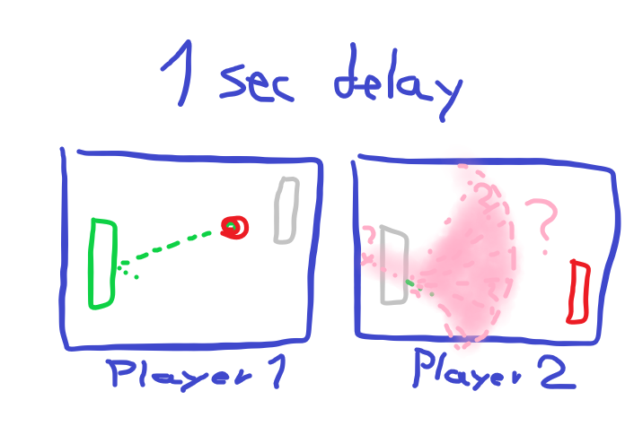

# Laggy pong / Quantum pong

> "The more precisely the position of a particle is known, the more uncertain the momentum is" 
> &ndash; Heisenberg's uncertainty principle

- Two-player online pong
- Show possible locations of the ball in real time
- Events should be simultaneous at the expense of knowing where the ball is.

